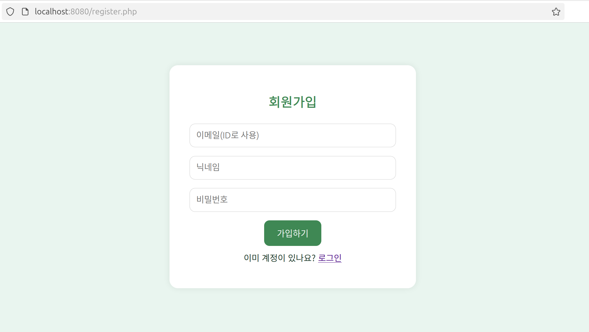
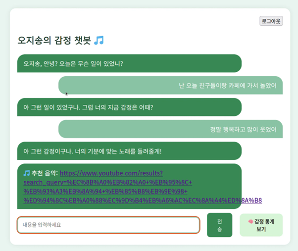

# 감정 기반 음악 추천 챗봇 (Rule-Based)

## 프로젝트 소개

사용자의 사건(Event)과 감정(Emotion)을 입력받아, 감정에 맞는 유튜브 음악을 추천해주는 **PHP 기반 챗봇 시스템**입니다.

- 로그인 / 회원가입 기능  
- 사건과 감정을 DB에 저장  
- 감정 통계 시각화 (Chart.js)  
- 간단한 룰 기반 감정 인식  
- Docker + MariaDB + PHP + Apache로 실행  

---

## 자율 구현 기능 (수업 외 확장)

> 이 프로젝트는 **단순 서버 환경 구축을 넘어** 실제 사용자 친화적인 웹 서비스 구현을 목표로 자율적으로 기능을 확장하였습니다.

| 확장 영역 | 상세 내용 |
|----------|----------|
| **데이터베이스 설계 및 생성** | `users`, `chat_history` 등 실제 운영 가능한 테이블 직접 설계 및 구축 |
| **동적 웹 페이지 구현** | `index.php`, `chatbot.php`, `emotion_stats.php` 등 PHP와 JS를 통한 실시간 대화/통계 구현 |
| **디자인 통일성 적용** | Bootstrap 기반 UI 구성으로 사용자 친화적인 일관된 웹 디자인 적용 |
| **감정 분류 로직 설계** | AI 모델이 아닌 **룰 기반 키워드 분석**으로 감정을 분류하고, 유튜브 검색어로 자동 연결 |
| **QR 코드 외부 접속 기능** | ngrok + QR 코드 생성기 활용, 모바일 접속 가능 시스템 구현 |
| **phpMyAdmin 관리 환경 구성** | Docker 기반 `phpMyAdmin` 연동 및 웹 브라우저에서 DB 직접 관리 가능하도록 설정 |

---

## 폴더 및 하위 파일 설명

<pre><code>📦 프로젝트 최상위 디렉토리 ├── db/ # DB 설정 및 초기화 SQL 포함 │ ├── Dockerfile # MariaDB 컨테이너 설정 파일 │ └── init.sql # DB 생성 및 테이블 정의 스크립트 ├── web/ # PHP 기반 웹 애플리케이션 코드 │ ├── Dockerfile # PHP + Apache 컨테이너 설정 │ ├── chatbot.php # 감정 분석 및 음악 추천 처리 │ ├── emotion_stats.php # 감정 통계 시각화 페이지 │ ├── functions.php # 공통 함수 및 DB 연결 정의 │ ├── index.php # 메인 대화 인터페이스 │ ├── login.php # 로그인 기능 처리 │ ├── logout.php # 로그아웃 처리 │ ├── register.php # 회원가입 처리 │ ├── register_success.php # 회원가입 성공 페이지 │ └── style.css # 전체 스타일 시트 ├── images/ # 실행화면 스크린샷 저장 폴더 │ └── (스크린샷 등 이미지 파일) ├── .gitignore # Git에서 제외할 파일 목록 ├── README.md # 프로젝트 설명 문서 └── docker-compose.yml # 전체 서비스 도커 구성 파일 </code></pre>


## 실행 방법

### 1. 프로젝트 클론

```bash
git clone https://github.com/OhJisong/Linix-project_Rule-based-chatbot.git
cd chatbot-project
```

### 2. 도커 실행

```bash
docker-compose up --build
```

### 3. 웹사이트 접속

```
http://localhost:8080
```

---

## 감정 분류 (Rule-Based)

| 감정     | 키워드 예시                              | 유튜브 검색 문구             |
|----------|------------------------------------------|------------------------------|
| 분노     | 화나, 짜증, 빡쳐, 열받아                 | 화났을 때 듣는 노래 플레이리스트 |
| 슬픔     | 우울, 슬퍼, 눈물, 절망                   | 우울할 때 듣는 노래 플레이리스트 |
| 외로움   | 외로워, 혼자, 쓸쓸해                     | 외로울 때 듣는 노래 플레이리스트 |
| 불안     | 불안, 초조, 긴장, 두려움                 | 불안할 때 듣는 노래 플레이리스트 |
| 걱정     | 걱정돼, 고민, 신경 쓰여                   | 걱정이 많을 때 듣는 노래 플레이리스트 |
| 사랑     | 사랑해, 좋아해, 설레, 그리워             | 사랑에 빠졌을 때 듣는 노래 플레이리스트 |
| 기쁨     | 행복해, 기뻐, 신나, 즐거워               | 신날 때 듣는 노래 플레이리스트 |

---

## 데이터베이스 구조

### users 테이블

| 필드명     | 타입     | 설명              |
|------------|----------|-------------------|
| id         | VARCHAR  | 사용자 ID (PK)    |
| nickname   | VARCHAR  | 사용자 닉네임     |
| password   | VARCHAR  | 해시된 비밀번호   |

### chat_history 테이블

| 필드명       | 타입     | 설명                   |
|--------------|----------|------------------------|
| id           | INT(AI)  | 고유번호 (PK)          |
| user_id      | VARCHAR  | 사용자 ID (FK)         |
| event        | TEXT     | 사용자가 말한 사건     |
| emotion      | VARCHAR  | 감정 (7가지 중 하나)   |
| youtube_link | TEXT     | 추천된 유튜브 링크     |
| created_at   | DATETIME | 기록 시각              |

---

## 외부 접속용 QR 생성

1. ngrok 설치 후 실행

```bash
ngrok http 8080
```

2. 생성된 주소(`https://xxxx.ngrok.io`) 복사  
3. [QR 코드 생성기](https://www.qr-code-generator.com/)로 QR 이미지 생성  
4. `/images/qr_code.png` 에 저장 후 README에 추가

---

## Docker 구조

- `docker-compose.yml`
    - PHP + Apache
    - MariaDB
    - phpMyAdmin (포트 8081)

---

## 스크린샷 예시

> `/images` 폴더에 포함

- 로그인 / 회원가입 화면


- 대화 인터페이스

- 감정 통계 차트

- DB


- playlist 추천

- QR 코드 접속 예시

* 해당 QR은 연결된 홈페이지를 삭제한 상태입니다. 

---

## 기타 정보

- AI 모델 제거됨 → 현재는 룰 기반 감정 분류만 적용  
- PHP 세션 기반 로그인 유지  
- 모든 기능은 `chatbot.php`, `index.php`, `emotion_stats.php` 등으로 모듈화

---

## 문의

- 작성자: 오지송 (Oh Jisong)  
- Email: ohjisong@ewha.ac.kr 
- GitHub: https://github.com/OhJisong  

---

## ❗주의 사항

### 가상환경 (venv) 제외

본 프로젝트는 Python 가상환경(venv)에서 개발되었으나, 해당 폴더는 GitHub에 업로드되지 않음.  
AI 모델 및 의존성은 현재 제거된 상태이며, 향후 필요 시 별도 설명 제공 예정.  
(참조: https://github.com/OhJisong/VM_Linux_chatbot-emotion_project)

### db_data 폴더 포함

- 유저 정보, 감정 기록이 저장된 샘플 DB 포함  
- 시스템 DB 제외, MariaDB 기본 설정 포함  
